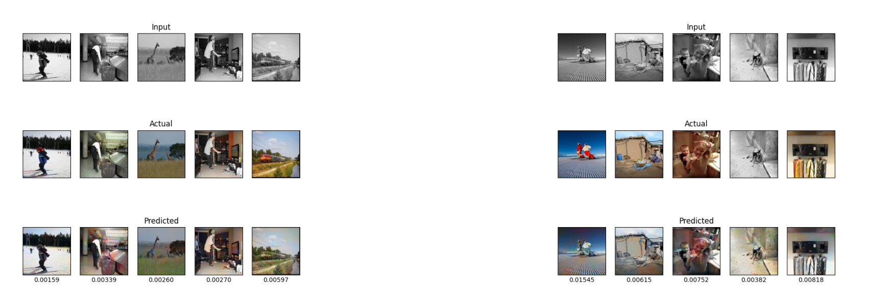
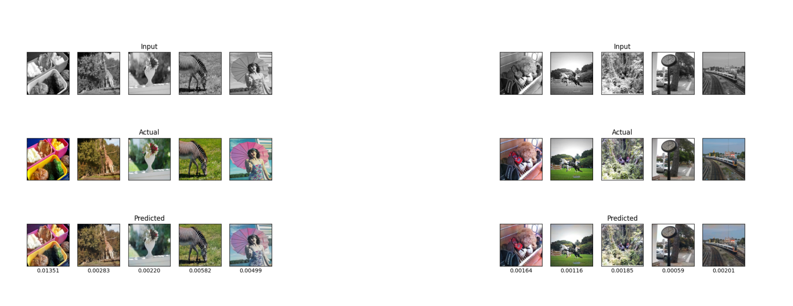

# CNN - Image Colorization

This is the codebase of an autoencoder model that attempts to solve the image colorization problem, where black and white images must be colorized properly.

The entire implementation is based on [PyTorch](https://github.com/pytorch/pytorch) and the dataset used is the [Image Colorization Dataset](https://www.kaggle.com/datasets/aayush9753/image-colorization-dataset).

## Requirements
First of all, the dataset must be downloaded and placed in the `data` folder. To train or test models, the following libraries/modules must be installed:
1) [PyTorch](https://github.com/pytorch/pytorch)
2) [Torchvision](https://github.com/pytorch/vision)
3) [Scikit-Image](https://github.com/scikit-image/scikit-image)
4) [Matplotlib](https://github.com/matplotlib/matplotlib)

## Output Examples
**Examples on the testing set**

**Examples on the training set**

## Documentation
The entire process is outlined in a series of Medium posts I wrote. You can read them in the following links:
1) [Building an Image Colorization Neural Network — Part 1: Generative Models and Autoencoders](https://medium.com/mlearning-ai/building-an-image-colorization-neural-network-part-1-generative-models-and-autoencoders-d68f5769d484)
2) [Building an Image Colorization Neural Network — Part 2: Artificial Neural Networks](https://medium.com/mlearning-ai/building-an-image-colorization-neural-network-part-2-artificial-neural-networks-ac591eb180)
3) [Building an Image Colorization Neural Network — Part 3: Convolutional Neural Networks](https://medium.com/mlearning-ai/building-an-image-colorization-neural-network-part-3-convolutional-neural-networks-21a45ef42dde)
4) [Building an Image Colorization Neural Network - Part 4: Implementation](https://medium.com/p/7e8bb74616c)
